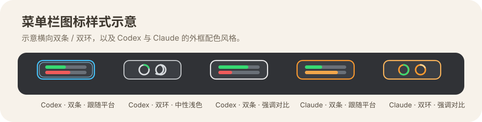

# Agent Account Hub 使用文档

这份文档面向日常使用，主要说明：

- 如何下载和启动 `Agent Account Hub.app`
- 如何保存和切换 `Codex` / `Claude Code` 账号
- 如何配置菜单栏用量展示
- 如何为 `Claude` 配置用量查询
- 如何配置 `Claude Code` 的 HUD / 状态栏展示

开始之前先记住一个前置条件：

- 建议在已开启代理环境时运行 `Agent Account Hub.app`
- 尤其是首次打开应用、刷新用量、使用菜单栏自动刷新、查看最新状态栏数据时
- 如果没有代理环境，应用本地界面仍然可以打开，但所有依赖外部接口的功能都会暂停，并可能显示 `proxy_unavailable`

## 1. 应用是做什么的

`Agent Account Hub` 是一个本地账号管理工具，当前主要支持两个平台：

- `Codex`
- `Claude Code`

它的核心能力是：

- 读取当前正在使用的认证
- 把当前认证保存成一条本地账号记录
- 在多条已保存账号之间快速切换
- 查询账号用量并展示到 macOS 菜单栏
- 为 `Claude Code` 生成和维护底部状态栏（HUD）配置

它管理的是认证快照和展示配置，不会去改你的聊天记录、项目历史或其他无关目录。

## 2. 下载与安装

### 2.1 推荐：通过 Homebrew 安装

```bash
brew install --cask gitliu-my/tap/agent-account-hub
```

如果已经安装过，升级可以用：

```bash
brew upgrade --cask gitliu-my/tap/agent-account-hub
```

### 2.2 通过 GitHub Release 安装

如果你不想使用 Homebrew，也可以直接下载发布页里的 `Agent Account Hub.app` 压缩包，解压后拖到 `Applications`。

仓库地址：

[https://github.com/gitliu-my/agent-account-hub](https://github.com/gitliu-my/agent-account-hub)

## 3. 启动方式

安装后直接打开 `Agent Account Hub.app` 即可。

更推荐的顺序是：

1. 先开启系统代理，或开启 Clash Verge 的 TUN / 系统代理模式
2. 再打开 `Agent Account Hub.app`

如果你没有开启代理：

- 应用仍然可以打开
- 本地账号保存、改名、切换这类纯本地操作仍可进行
- 但用量查询、自动刷新、菜单栏最新状态同步、Claude HUD 的联网数据刷新会暂停

启动后的默认行为：

- 应用默认以菜单栏后台应用方式运行
- 右上角会出现状态栏图标
- 默认不会自动弹出控制台窗口
- 需要时可从菜单栏点击 `打开控制台`

控制台打开后：

- 会以内嵌窗口形式显示
- 此时 Dock 中会出现应用图标
- 左上角会有正常的 macOS 应用菜单

## 4. 先理解几个概念

### 4.1 当前认证

“当前认证”表示当前平台此刻真正正在使用的登录状态。

例如：

- `Codex` 的当前认证来自 `~/.codex/auth.json`
- `Claude Code` 的当前认证来自 macOS Keychain 中的 `Claude Code-credentials`

### 4.2 已保存账号

“已保存账号”是 Hub 自己保存的一条本地账号记录，用来做切换和展示，不等于你当前已经切过去了。

你可以把它理解成：

- 当前认证：现在真的在用谁
- 已保存账号：我存下来的多个可切换备份

### 4.3 Provider

界面顶部有两个平台页签：

- `Codex`
- `Claude`

这里切换的是“管理哪个平台”，不是切换真实登录账号。

### 4.4 三个最常用操作

在账号卡片和配置区里，最常用的是这三个动作：

- `保存当前`：把当前登录保存成一条新的本地账号记录
- `当前覆盖`：用当前真实登录状态覆盖某条已保存账号
- `切换`：把某条已保存账号切换成当前真实登录状态

补充：

- `删除` 只删除 Hub 里的这条已保存记录，不会直接注销当前登录
- `保存名称` 只修改 Hub 里的显示名称，方便区分账号，不影响真实认证

## 5. 第一次使用：Codex

这是最推荐的上手顺序。

### 5.1 先登录 Codex

先在你平时使用的 `Codex` 环境中完成登录，确保当前真实认证已经是你想保存的那个账号。

应用读取的是：

```text
~/.codex/auth.json
```

### 5.2 打开 Agent Account Hub

打开应用后：

1. 在顶部切到 `Codex`
2. 在左侧导航查看 `当前认证`
3. 确认当前邮箱、账号 ID、Plan、Access Token 状态都正常

### 5.3 保存当前账号

点击顶部的 `保存当前`。

保存后会在 `账号列表` 和 `账号配置` 中出现一条新的已保存账号记录。

### 5.4 修改账号名称

为了避免多个账号分不清，建议保存后立刻在 `账号配置` 里改名。

推荐命名方式例如：

- `工作主号`
- `个人 Plus`
- `测试号 A`
- `sixmingyue@gmail.com`

### 5.5 保存第二个或更多 Codex 账号

如果你要保存多个 Codex 账号：

1. 先在外部把 Codex 登录切到另一个账号
2. 回到 Agent Account Hub
3. 点击 `同步`
4. 再点击 `保存当前`
5. 给新账号改一个容易区分的名字

### 5.6 切换 Codex 账号

当你已经保存了多个账号后：

1. 打开 `Codex` 页签
2. 在 `账号列表` 中找到目标账号
3. 点击 `切换`

切换成功后：

- `~/.codex/auth.json` 会被替换为该已保存账号的认证快照
- 页面里的 `当前认证` 会更新
- 之后再打开或继续使用 Codex 时，会基于这套认证运行

### 5.7 当前覆盖什么时候用

如果你当前已经重新登录过同一个账号，想把最新 token 覆盖回已保存记录，就用 `当前覆盖`。

典型场景：

- 账号没变，但 token 已刷新
- 当前账号还是原来的主号，只想同步最新认证
- 当前页面显示某条已保存账号“认证失效”，你刚刚又重新登录好了

## 6. Codex 用量查询

### 6.1 Codex 不需要额外网页认证

当前版本里，`Codex` 的用量查询直接使用这条已保存账号快照中的 `access token`。

也就是说：

- 不需要你额外配置网页 Cookie
- 不需要再单独配置 `sessionKey`
- 只要保存下来的账号快照里有可用 `access token`，就可以查询

### 6.2 在哪里看

在 `账号配置` 中选中一个 Codex 账号后，你会看到：

- `Codex 用量来源`
- `用量状态`

这里会显示：

- `5h` 已用百分比
- `7d` 已用百分比
- 各自的重置时间
- 最近刷新时间

补充：

- `Codex` 用量查询本身需要可用代理环境
- 如果没开代理，页面会暂停请求，并提示当前未检测到代理环境

### 6.3 认证失效怎么处理

如果某条 Codex 账号显示：

- `认证失效`
- `缺少 access token`
- `Codex access token 已失效`

通常表示这条已保存快照已经不能再拿来查询用量了。

处理方法：

1. 重新登录目标 Codex 账号
2. 回到应用点击 `同步`
3. 对原账号执行 `当前覆盖`

## 7. Codex 菜单栏用量展示

### 7.1 进入配置位置

在 `Codex` 页签下，打开左侧导航的 `账号配置`。

你会看到三个区域：

- `展示样式`
- `当前展示`
- `可选账号`

### 7.2 哪些账号能加入菜单栏

对 `Codex` 来说，一般满足下面条件就可以加入菜单栏：

- 这条已保存账号里有可用的 `access token`
- 账号处于可查询状态

首次加入后，如果还没成功拉到真实用量，菜单栏可能先显示占位状态；一旦成功刷新过，就会显示真实 `5h / 7d` 百分比。

### 7.3 如何加入菜单栏

1. 在 `可选账号` 中找到目标账号
2. 点击加入菜单栏展示
3. 账号会出现在 `当前展示`

### 7.4 如何调整顺序

在 `当前展示` 中使用上移 / 下移按钮调整顺序即可。

这个顺序会直接影响右上角菜单栏里的排列顺序。

### 7.5 如何改样式

当前支持的菜单栏图标样式：

- `横向双条`
- `双环`

当前支持的外框配色：

- `跟随平台`
- `中性浅色`
- `强调对比`

菜单栏样式示意：



### 7.6 如何识别平台和当前活动账号

菜单栏图标里已经做了平台区分：

- `Claude Code` 会偏橙色风格
- `Codex` 会用更中性的浅色 / 系统强调色

如果某个账号正好是当前正在使用的账号，外轮廓会有额外高亮，更容易分辨。

## 8. 第一次使用：Claude Code

### 8.1 先登录 Claude Code

先确保 `Claude Code` 已经登录到你想保存的账号。

当前认证主来源是 macOS Keychain 中的：

```text
Claude Code-credentials
```

### 8.2 保存 Claude Code 账号

1. 打开应用
2. 切到顶部的 `Claude`
3. 在 `当前认证` 中确认邮箱、姓名、账号 ID 等信息正常
4. 点击 `保存当前`
5. 到 `账号配置` 里把名称改成你容易识别的名字

### 8.3 切换 Claude Code 账号

和 Codex 一样：

1. 找到目标已保存账号
2. 点击 `切换`

切换成功后，Hub 会把这条保存记录对应的凭据写回当前 Claude Code 使用的认证位置。

## 9. Claude 用量查询配置

### 9.1 目前需要额外配置 claude.ai 认证

当前版本中，`Claude Code` 的 CLI 认证和 `claude.ai` 网页用量查询不是同一套配置。

所以如果你想查 `Claude` 的订阅用量，仍然需要为每个账号单独配置：

- `sessionKey`
- `organizationId`

### 9.2 在哪里配置

进入：

1. 顶部切到 `Claude`
2. 左侧进入 `账号配置`
3. 选中你要配置的那条账号
4. 在 `claude.ai 认证信息` 模块中点击 `配置认证` 或 `编辑认证`

### 9.3 支持直接粘贴什么

当前弹窗支持直接粘贴：

- 原始 `sessionKey`
- 整段 `Cookie`
- 整段 `Request headers`
- `usage` 请求 URL

应用会自动尝试提取：

- `sessionKey`
- `organizationId`

你也可以手动填写：

- `Claude.ai Session`
- `Organization`
- `Organization Name`

其中：

- `Organization Name` 只是你自己看的显示名称，推荐填写
- 它不会影响真实组织权限

### 9.4 保存后会发生什么

点击 `保存并刷新用量` 后，应用会：

1. 保存组织信息
2. 把 `sessionKey` 存进 macOS Keychain
3. 立即尝试请求 `claude.ai` 用量
4. 刷新页面里的 `5h / 7d` 百分比和重置时间

这里也请注意：

- 这一步依赖代理环境
- 如果当前没有代理，认证信息仍然会保存下来
- 但立即刷新用量会被暂停，等代理恢复后再手动刷新或等待自动刷新即可

### 9.5 配置成功后能做什么

当某个 `Claude` 账号成功获取过一次有效用量后，你就可以：

- 在页面中看 `5h / 7d` 百分比
- 查看两个窗口的重置时间
- 把这个账号加入菜单栏展示
- 用它驱动 `Claude Code` HUD 中的用量信息

## 10. Claude Code HUD / 状态栏配置

### 10.1 入口在哪里

进入：

1. 顶部切到 `Claude`
2. 左侧导航点击 `状态栏`

### 10.2 这个页面能做什么

你会看到两个核心区域：

- `当前预览`
- `展示项`

预览会随着你的配置修改即时更新，用来模拟 Claude Code 底部状态栏最终会是什么样子。

HUD 预览示意：


### 10.3 可配置的内容

基础信息部分可以控制是否显示：

- 目录
- 模型
- 账号简称
- 上下文
- `Ctx` 标签
- 24 小时制

用量窗口部分可以分别控制 `5h` 和 `7d`：

- 是否显示用量
- 是否显示进度条
- 是否显示节奏标记
- 是否显示重置时间
- 是否显示标签

另外还可以配置：

- `进度条宽度`
- `分隔样式`

### 10.4 保存样式 和 应用到 CLI 的区别

这两个动作一定要区分开：

- `保存样式`：只保存 Hub 内部的样式草稿
- `应用到 CLI`：把当前样式真正写入 `Claude Code` 的配置

也就是说：

- 你可以先随便调整、预览、保存草稿
- 只有点击 `应用到 CLI` 后，Claude Code 才会真的使用这套状态栏

### 10.5 应用后会写到哪里

应用后，Hub 会更新：

```text
~/.claude/settings.json
```

同时会安装两个辅助脚本：

```text
~/.claude/agent-account-hub-statusline.sh
~/.claude/agent-account-hub-statusline.pl
```

停用时，会把这条状态栏命令从 `settings.json` 中移除。

### 10.6 HUD 数据来源

当前 `Claude Code` HUD 预览和实际展示优先读取：

- Claude Code 官方传入的 stdin 信息

如果缺少某些字段，再回退到：

- Agent Account Hub 本地缓存

所以只要你已经把账号和用量配好，HUD 一般就能稳定显示模型、账号、上下文和用量相关片段。

## 11. 自动刷新与代理说明

### 11.1 自动刷新频率

当前版本默认行为大致是：

- 控制台状态约每 `1` 分钟刷新一次
- 用量约每 `5` 分钟自动刷新一次

如果你想立刻更新，也可以手动点：

- `同步`
- `刷新用量`
- 菜单栏中的 `刷新状态`

### 11.2 没有代理时会怎样

应用现在带有代理可用性保护。

如果本机没有检测到可用代理环境，应用会暂停对外部用量接口的请求，避免在无代理状态下频繁直连外网接口。

这时你可能会看到类似状态：

- `当前未检测到代理环境`
- `proxy_unavailable`

恢复代理后，再手动刷新或等待自动刷新即可。

可以把这一条简单理解成：

- 想让 app 的联网功能正常工作，请先开代理
- 想让菜单栏一直显示最新用量，请保持代理环境可用
- 如果只是临时做本地账号切换，没开代理也能用，但不要期待它去更新外部数据

## 12. 数据和敏感信息存放位置

### 12.1 当前真实认证

`Codex` 当前认证：

```text
~/.codex/auth.json
```

`Claude Code` 当前认证：

- macOS Keychain
- 服务名：`Claude Code-credentials`

### 12.2 Agent Account Hub 自己保存的数据

打包版 `.app` 默认会把自己的数据放在：

```text
~/Library/Application Support/Agent Account Hub
```

其中大致包括：

- `Codex` 已保存账号快照
- `Claude Code` 已保存账号快照
- 用量缓存
- 菜单栏展示配置
- HUD 样式草稿

### 12.3 Claude 用量 sessionKey 存放位置

`Claude` 用量查询用到的 `sessionKey` 会单独保存到 macOS Keychain：

- 服务名：`Agent Account Hub-claude.ai-session`

组织 ID、组织名称、用量缓存等会保存在应用自己的数据目录中。

## 13. 常见问题

### 13.1 为什么我切换了平台，但真实账号没变

因为顶部的 `Codex / Claude` 页签只是切换管理视图，不是切换账号。

要真正切换账号，需要点对应账号的 `切换`。

### 13.2 为什么我改了名称，真实邮箱或登录名没变

因为 `账号名称` 只是 Hub 内部的显示别名，只用于帮助你区分账号。

### 13.3 为什么 Claude 账号还不能加入菜单栏

通常是因为还没满足下面条件：

- 还没配置 `claude.ai` 认证
- `sessionKey` / `organizationId` 无效
- 还没成功获取过一次有效用量

### 13.4 为什么 Codex 账号显示认证失效

通常表示这条保存快照中的 `access token` 已经过期或不可用。

处理方式：

1. 重新登录对应 Codex 账号
2. 回到应用点击 `同步`
3. 对该账号执行 `当前覆盖`

### 13.5 为什么保存了状态栏样式，但 Claude Code 里没变化

因为你可能只点了 `保存样式`，还没有点 `应用到 CLI`。

### 13.6 菜单栏里看不到用量图标怎么办

先确认：

- 已经至少加入了一条菜单栏展示账号
- 该账号满足展示条件
- 对应平台的用量已经成功刷新
- 当前系统代理环境可用

如果当前没有任何可展示账号，菜单栏会退回到较简化的占位状态。

## 14. 高级用法：CLI

如果你更习惯命令行，也可以直接使用 CLI。

查看当前 Codex 认证：

```bash
agent-account-hub current
```

列出已保存 Codex 账号：

```bash
agent-account-hub list
```

保存当前 Codex 账号为新记录：

```bash
agent-account-hub capture-new
```

切换到某个 Codex 账号：

```bash
agent-account-hub switch <account-id>
```

切换到 Claude Code provider 再操作：

```bash
agent-account-hub --provider claude-code current
agent-account-hub --provider claude-code list
agent-account-hub --provider claude-code capture-new
agent-account-hub --provider claude-code switch <account-id>
```

## 15. 推荐使用顺序

如果你想最顺畅地用起来，可以按这个顺序：

1. 先登录 `Codex`
2. 打开 `Agent Account Hub`
3. 在 `Codex` 页签点击 `保存当前`
4. 给账号改一个容易区分的名字
5. 再保存其他 `Codex` 账号
6. 如果要展示菜单栏，先把用量刷成功，再加入菜单栏
7. 再切到 `Claude`
8. 保存 `Claude Code` 当前账号
9. 为需要查询用量的 `Claude` 账号配置 `claude.ai` 认证
10. 成功刷新用量后，把需要的账号加入菜单栏
11. 最后到 `状态栏` 页面调 HUD，并点击 `应用到 CLI`

这样基本就能把账号保存、切换、菜单栏展示和 Claude HUD 一次性配好。
